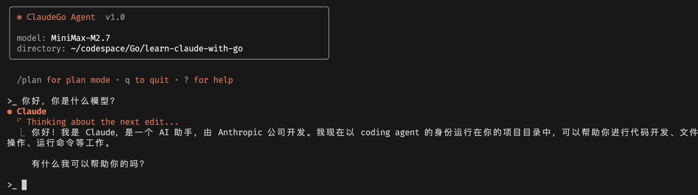
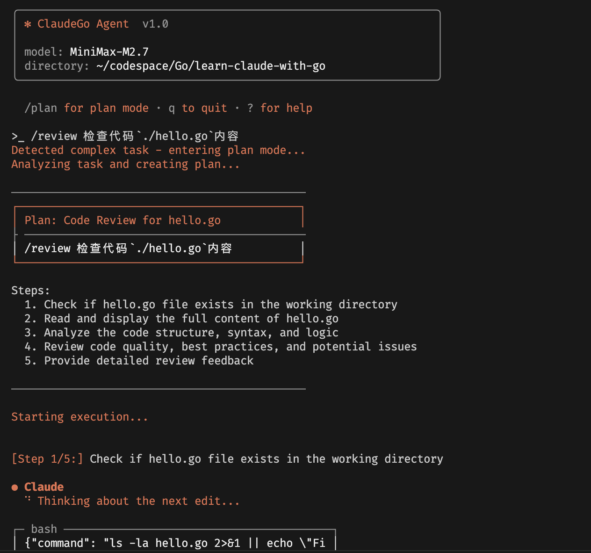
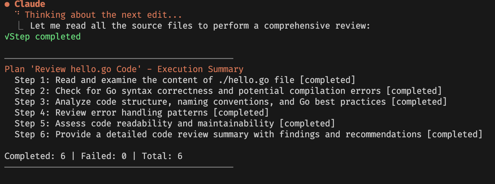

# ClaudeGo

A CLI-based AI coding agent written in Go, powered by LLMs via a streaming REPL interface.



## Features

- **Interactive REPL** — Built on `liner` library with full line editing, history navigation (up/down arrows), ANSI-styled colored output; Ctrl+C interrupts current LLM call and rolls back conversation state
- **LLM Streaming** — Wraps OpenAI-compatible API via `openai-go` SDK with streaming text completions and function calling (tool use)
- **Plan Mode** — Automatically detects complex tasks (refactor, migrate, multi-file implementation, etc.), decomposes them into multi-step plans executed sequentially; plans persisted as JSON to `~/.claudego/plans/`, resumable by plan ID
- **Built-in Tools** — Plugin-style `ToolRegistry` architecture with `bash` tool (dangerous command detection: blocks `rm -rf /`, fork bombs, remote script injection, etc.) and `file_handler` tool (read/write/edit files); extensible with custom tools
- **Conversation State Management** — Checkpoint-based rollback mechanism preserves conversation history integrity across interrupts
- **Rotating Logs** — Structured logging via `logrus` with daily file rotation, 7-day retention

## Architecture

```
cmd/claudego/main.go        — REPL entry point, signal handling, command routing
internal/loop/agent.go      — Agent loop: streams LLM responses, executes tools
internal/plan/              — Plan mode (create, execute, persist)
  ├── plan.go              — Plan data structure
  ├── planner.go           — Plan creator
  └── executor.go           — Plan executor
internal/tools/            — Tool registry + built-in tools
  ├── registry.go          — Tool registry
  ├── base_tool.go         — Tool base interface
  ├── bash.go              — bash tool (dangerous command detection)
  ├── file.go              — file_handler tool
  └── task.go              — Task tool
internal/config/           — JSON config loader
pkg/llm/                   — LLM client wrapping openai-go SDK
pkg/conversation/          — Conversation state with checkpoint/rollback
pkg/ui/                    — CLI styling, markdown rendering, streaming output
pkg/logger/                — Singleton logger (logrus)
pkg/skill/                 — Skill extension system
  ├── skill_registry.go    — Skill registry
  ├── loader.go            — Markdown loader (folder-based structure supported)
  ├── executor.go          — Skill executor (LLM integration)
  └── handler.go           — Skill matching and execution entry point
pkg/types/                 — Shared type definitions
pkg/interfaces/            — Core interface definitions (ToolInterface, LLMInterface)
```

## Installation

```bash
git clone https://github.com/yizhigopher/learn-claude-with-go.git
cd learn-claude-with-go
go build -o claudego ./cmd/claudego
```

## Configuration

Create `~/.claudego/config.json`:

```json
{
  "api_key": "your-api-key",
  "base_url": "https://api.deepseek.com/v1",
  "model": "deepseek-chat"
}
```

- `api_key` — Your LLM provider API key
- `base_url` — OpenAI-compatible API endpoint
- `model` — Model name (e.g. `deepseek-chat`, `gpt-4o`)

## Usage

```bash
./claudego
```

### REPL Commands

| Command | Description |
|---------|-------------|
| `q` / `exit` | Quit the session |
| `/plan <goal>` | Force plan mode for a specific goal |
| `/skill <name> [args]` | Execute a skill extension |

### Auto-detection

ClaudeGo automatically detects complex tasks (refactor, migrate, implement, build, etc.) and switches to plan mode.

### Plan Mode

When plan mode activates:

1. The agent analyzes your goal and creates a step-by-step plan
2. Steps are displayed and saved to `~/.claudego/plans/`
3. Each step executes in sequence with LLM + tool access
4. Press `Ctrl+C` to interrupt — conversation rolls back to the last checkpoint
5. Resume a paused plan with the saved plan ID




### Skill Extension System

ClaudeGo supports custom skills defined via Markdown files stored in `~/.claudego/skills/`.

**Skill file format:**

```markdown
---
name: skill-name
description: Description of what this skill does
---

# Skill Name

[LLM prompt content]
```

Loaded skills can be invoked via `/skill skill-name` or triggered via auto-completion in conversation.

### Built-in Tools

**bash** — Execute shell commands
- Dangerous commands are blocked: `rm -rf /`, `sudo`, `shutdown`, fork bombs, piping remote scripts, etc.

**file_handler** — Read, write, and edit files

### Conversation Rollback

Press `Ctrl+C` during any LLM call to interrupt. The conversation state is rolled back to the checkpoint before the current query, preserving the integrity of your conversation history.

## Dependencies

- [openai-go](https://github.com/openai/openai-go) — LLM API client
- [liner](https://github.com/peterh/liner) — Line editing for REPL
- [logrus](https://github.com/sirupsen/logrus) — Logging
- [go-playground/validator](https://github.com/go-playground/validator) — Input validation

## Project Structure

```
claudego/
├── cmd/claudego/main.go       # Application entry point
├── internal/
│   ├── loop/agent.go          # Agent loop
│   ├── plan/                  # Plan mode (create, execute, persist)
│   ├── tools/                 # Tool registry + built-in tools
│   └── config/                # Configuration loader
├── pkg/
│   ├── llm/                   # LLM client
│   ├── conversation/          # Conversation state
│   ├── ui/                    # CLI output styling
│   ├── logger/                # Logging
│   ├── skill/                 # Skill extension system
│   ├── types/                 # Shared types
│   └── interfaces/            # Core interface definitions
└── utils/                     # Utilities
```

## License

MIT
